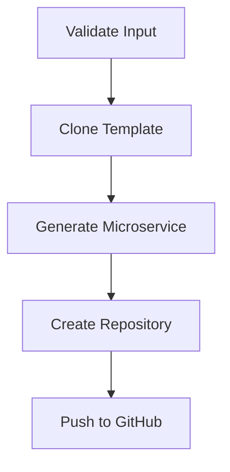

# Create Microservice Workflow

This Helm chart automates the process of creating microservices, including validating inputs, checking out templates,
scaffolding microservices, and creating repositories on GitHub.

## Overview

This Helm chart defines a set of Workflow Templates and a main Workflow that:

1. Validates input parameters for the microservice (service name, owner username, team, description).
2. Clones a specified template from GitHub.
3. Generates the microservice code based on the input parameters and the template.
4. Creates a GitHub repository (if it doesn't exist).
5. Pushes the generated code to the newly created GitHub repository.



## Prerequisites

- [Docker for Desktop](https://www.docker.com/products/docker-desktop/)
- [Kubernetes](https://kubernetes.io/) v1.27.2
- [Argo Workflows](https://argoproj.github.io/argo-workflows/) v3.4.9
- [Argo CLI](https://argoproj.github.io/argo-workflows/walk-through/argo-cli/) v3.4.9
- [Helm](https://helm.sh/) 3.x or higher.

## Dependencies

This workflow relies on specific container images to perform certain steps. Make sure you have access to the following
images and repositories:

### Container Images

- **Step Validator Image:** This image is used to validate input parameters during the workflow execution. The source
  code and Dockerfile can be found at [adriandantas/step-validator](https://github.com/adriandantas/step-validator).

- **Cookiecutter Image:** This image is utilized to create a new project from a template repository. The source code and
  Dockerfile are available at [adriandantas/cookiecutter](https://github.com/adriandantas/cookiecutter).

### Cookiecutter Template Repository

- **Quarkus Application Template:** The workflow uses this template to generate a new Quarkus application. The template
  repository can be found
  at [adriandantas/cookiecutter-quarkus-app](https://github.com/adriandantas/cookiecutter-quarkus-app).

## Installation

### Clone the Repository

```bash
git clone https://github.com/adriandantas/create-microservice-workflow.git
cd create-microservice-workflow
```

### Helm Chart Configuration

#### GitHub Token Secret

The Helm chart includes a template to create a Kubernetes Secret to hold the GitHub token. This token is used for
authentication with the GitHub API. Make sure to provide your GitHub token in the values.yaml file or during the Helm
install.

#### Role Binding for Argo Workflow

The Helm chart includes a role binding that grants the admin cluster role to the default service account in the argo
namespace. This role binding allows the Argo Workflow service account to have administrative privileges, which can be
necessary for executing certain operations within the namespace.

##### Role Binding Configuration

The role binding is defined in the `templates/rolebinding.yaml` file and can be customized using the following
parameters in the `values.yaml` file:

- `rolebinding.name`: The name of the role binding (default: default-admin).
- `rolebinding.clusterRole`: The cluster role to bind to the service account (default: admin).
- `rolebinding.serviceAccountName`: The name of the service account to bind to the cluster role (default: default).
- `rolebinding.namespace`: The namespace in which the role binding and service account are defined (default: argo).

###### Example - customizing Role Binding Configuration

To customize the role binding, you can modify the values in `values.yaml` or provide them when installing the Helm chart
using the `--set` option. Here's an example of how to set a custom service account name:

```bash
helm install my-release ./my-chart --set rolebinding.serviceAccountName=my-service-account
```

### Install Helm Chart

```bash
helm install create-microservice-release ./helm-chart
```

# Running the demo

### Enabling port-forwarding to Argo Workflows server

Create a port-forward to the Argo Workflows server:

```shell
kubectl -n argo port-forward deployment/argo-server 2746:2746
```

### Submit workflow using Argo CLI¶

```shell
argo submit \
  -n argo \
  --watch \
  create-microservice-workflow.yaml \
  --parameter service-name="deepStateCatalog" \
  --parameter owner-username="the_grandmaster" \
  --parameter team="council-of-foreign-relations" \
  --parameter description="A catalog organizational assets infiltrated nation states"
```