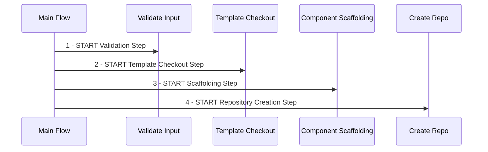

# Create Component Workflow

This Helm chart automates the process of creating components, including validating inputs, checking out templates,
scaffolding components, and creating repositories on GitHub.

## Overview

This Helm chart defines a set of Workflow Templates and a main Workflow that:

1. Validates input parameters for the component (service name, owner username, team, description).
2. Clones a specified template from GitHub.
3. Generates the component code based on the input parameters and the template.
4. Creates a GitHub repository (if it doesn't exist).
5. Pushes the generated code to the newly created GitHub repository.

#### High-Level Workflow Diagram


## Prerequisites

- [Docker for Desktop](https://www.docker.com/products/docker-desktop/)
- [Kubernetes](https://kubernetes.io/) v1.27.2
- [Argo Workflows](https://argoproj.github.io/argo-workflows/) v3.4.9
- [Argo CLI](https://argoproj.github.io/argo-workflows/walk-through/argo-cli/) v3.4.9
- [Helm](https://helm.sh/) 3.x or higher.

## Dependencies

This workflow relies on specific container images to perform certain steps. Make sure you have access to the following
images and repositories:

### Container Images

- **Step Validator Image:** This image is used to validate input parameters during the workflow execution. The source
  code and Dockerfile can be found at [adriandantas/step-validator](https://github.com/adriandantas/step-validator).

- **Cookiecutter Image:** This image is utilized to create a new project from a template repository. The source code and
  Dockerfile are available at [adriandantas/cookiecutter](https://github.com/adriandantas/cookiecutter).

### Cookiecutter Template Repository

- **Quarkus Application Template:** The workflow uses this template to generate a new Quarkus application. The template
  repository can be found
  at [adriandantas/cookiecutter-quarkus-app](https://github.com/adriandantas/cookiecutter-quarkus-app).

## Installation

### Clone the Repository

```shell
git clone https://github.com/adriandantas/create-component-workflow.git
cd create-component-workflow
```

### Demo Setup Chart

The demo setup chart is used to install the dependencies for the demo, including a secret to hold the GitHub token and a
role binding that grants the admin cluster role to the default service account in the argo
namespace.

```shell
helm install -n argo automation-demo-setup ./automation-demo-setup --set githubToken=<your-github-token>
```

### Automation Steps Chart

Since several steps can be reused in different workflows, we have created a chart to install the automation steps. This
chart installs the following steps:

```shell
helm install -n argo automation-steps ./automation-steps
```

### Create Component Automation Chart

This chart installs the workflow template that creates component repositories using as source a cookiecutter template
and replacing template variables with values passed as workflow input arguments.

```shell
helm install -n argo create-component-automation ./create-component-automation
```

## Running The Demo

### Enabling port-forwarding to Argo Workflows server

Create a port-forward to the Argo Workflows server:

```shell
kubectl -n argo port-forward deployment/argo-server 2746:2746
```

### Executing an Automation Workflow

Submit the demo automation workflow using Argo CLI¶

```shell
argo submit -n argo  --watch \
  create-component.yaml \
  --parameter service-name="deepStateCatalog" \
  --parameter owner-username="the_grandmaster" \
  --parameter team="council-of-foreign-relations" \
  --parameter description="A catalog organizational assets infiltrated nation states"
```

## Uninstalling the Demo

Just uninstall the Helm charts with the following commands:

```shell
helm uninstall -n argo create-component-automation
helm uninstall -n argo automation-steps
helm uninstall -n argo automation-demo-setup
```