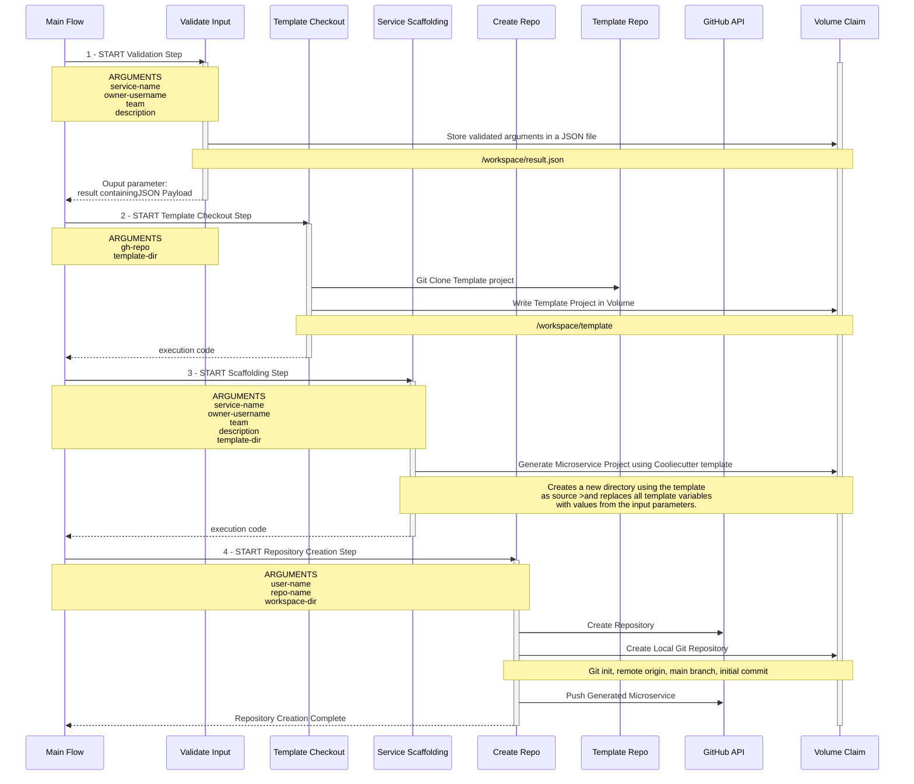

## create-microservice-workflow sequence diagram

```mermaid
sequenceDiagram
  participant MainFlow as Main Flow
  participant ValidateInput as Validate Input
  link ValidateInput: Repo @ https://github.com/adriandantas/step-validator
  participant TemplateCheckout as Template Checkout
  participant MicroserviceScaffolding as Service Scaffolding
  link MicroserviceScaffolding: Repo @ https://github.com/adriandantas/cookiecutter
  participant CreateRepository as Create Repo
  participant TemplateRepo as Template Repo
  participant GitHub as GitHub API
  participant VolumeClaim as Volume Claim

  MainFlow->>ValidateInput: 1 - START Validation Step
  activate ValidateInput
  activate VolumeClaim
  Note over MainFlow,ValidateInput: ARGUMENTS<br/>service-name<br/>owner-username<br/>team<br/>description
  ValidateInput->>VolumeClaim: Store validated arguments in a JSON file
  Note over ValidateInput,VolumeClaim: /workspace/result.json
  ValidateInput-->>MainFlow: Ouput parameter:<br/>result containingJSON Payload
  deactivate ValidateInput

  MainFlow->>TemplateCheckout: 2 - START Template Checkout Step
  activate TemplateCheckout
  Note over MainFlow,ValidateInput: ARGUMENTS<br/>gh-repo<br/>template-dir
  TemplateCheckout->>TemplateRepo: Git Clone Template project
  TemplateCheckout->>VolumeClaim: Write Template Project in Volume
    Note over TemplateCheckout,VolumeClaim: /workspace/template
  TemplateCheckout-->>MainFlow: execution code
  deactivate TemplateCheckout

  MainFlow->>MicroserviceScaffolding: 3 - START Scaffolding Step
  activate MicroserviceScaffolding
  Note over MainFlow,MicroserviceScaffolding: ARGUMENTS<br/>service-name<br/>owner-username<br/>team<br/>description<br/>template-dir
  MicroserviceScaffolding->>VolumeClaim: Generate Microservice Project using Cooliecutter template
    Note over MicroserviceScaffolding,VolumeClaim: Creates a new directory using the template<br/> as source >and replaces all template variables<br/>with values from the input parameters.
  MicroserviceScaffolding-->>MainFlow: execution code
  deactivate MicroserviceScaffolding

  MainFlow->>CreateRepository: 4 - START Repository Creation Step
  activate CreateRepository
  Note over MainFlow,CreateRepository: ARGUMENTS<br/>user-name<br/>repo-name<br/>workspace-dir
  CreateRepository->>GitHub: Create Repository
  CreateRepository->>VolumeClaim: Create Local Git Repository
  Note over CreateRepository,VolumeClaim: Git init, remote origin, main branch, initial commit
  CreateRepository->>GitHub: Push Generated Microservice
  CreateRepository-->>MainFlow: Repository Creation Complete
  deactivate CreateRepository
  deactivate VolumeClaim
```
